# `@Provide` / `@Consume` 流程与边界场景排查

配套设计文档：`2026-07-13-keystone-context-provide-consume-design.md`。
目的：把 context 协议在各种使用/时序下的数据流画出来，逐个排查**哪些边界会静默出错**，
以此决定 keystone 端口要保留/简化/加固哪些机制。

## 0. 运行时构件回顾（精确到调用点）

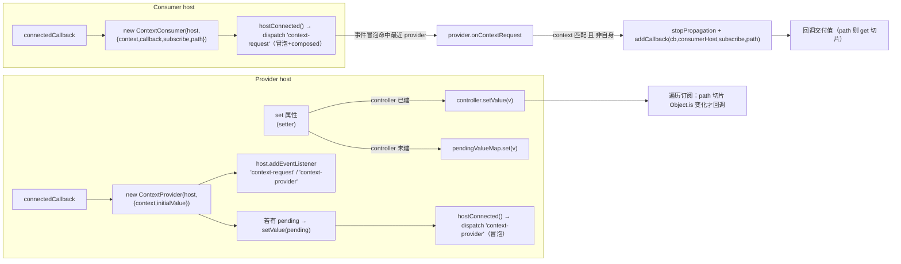

要点：
- `context-request` **冒泡 + composed**，被**最近**的匹配 provider `stopPropagation` 截获 → “就近绑定”。
- `subscribe:false`：交付一次即返回，不进订阅表。
- `subscribe:true`：进订阅表，`setValue` 时按 `path` 切片 `Object.is` 去重后回调。
- consumer 收到值 → `forceUpdate(host)` 请求重渲染。

---

## 场景 A：静态树，provider 先于 consumer 连接（最常见）✅

自定义元素自上而下 upgrade，父 provider 先连接，子 consumer 后连接。

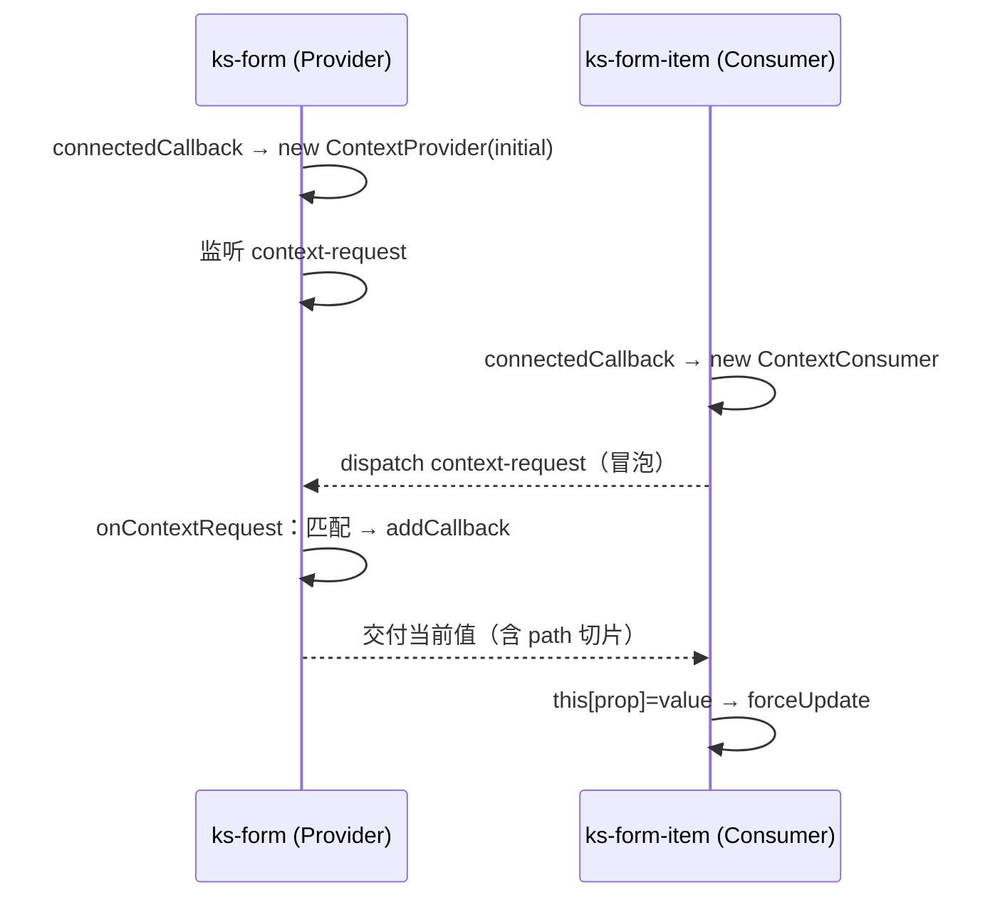

**结论**：正常。consumer 连接时 provider 已就位，请求立即得到应答。**re-parenting 不触发。**

---

## 场景 B：顶层 provider 迟到（consumer 连接时无任何 provider）❌ 已知缺口

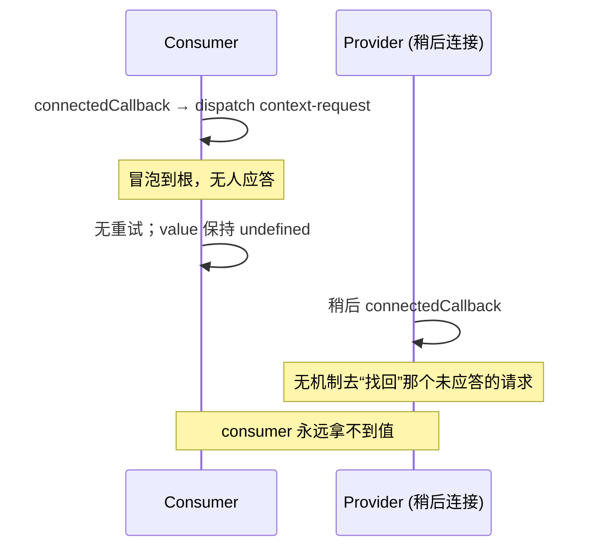

**边界风险（高）**：`subscribe` 与否都一样坏。参考实现与本端口都**无 `ContextRoot`**（Lit 用它在文档根缓冲未应答请求）。
re-parenting **救不了**这个 —— 它只在“已有祖先 provider 持有订阅”时重派。
**排查项**：库里是否存在“consumer 可能先于其顶层 provider 连接”的路径？（懒注册顶层 provider、条件渲染 provider、provider 在 consumer 之后插入 DOM。）
若存在 → 需要 `ContextRoot` 或“consumer 侧有限重试”。

---

## 场景 C：嵌套同 context provider，静态顺序 ✅

`FormContext` 由 `ks-form` → `ks-form-item` 多层提供，`ks-radio` 消费。

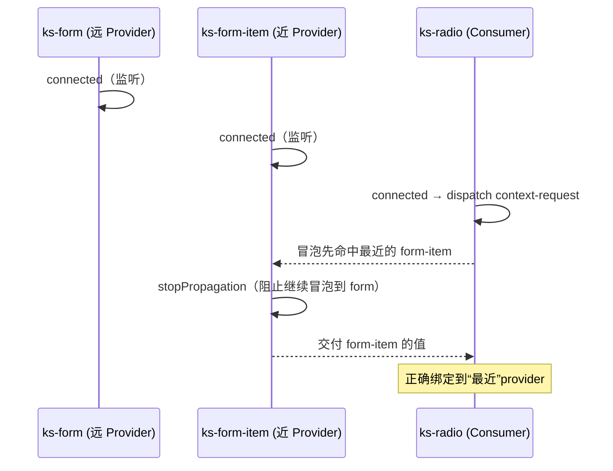

**结论**：正常。`stopPropagation` 保证就近。re-parenting 不触发。

---

## 场景 D：更近的 provider 迟到（异步 upgrade / 动态插入）⚠️ re-parenting 的唯一用武之地

`ks-radio` 先绑到外层 `ks-form`，之后中间的 `ks-form-item` 才连接。

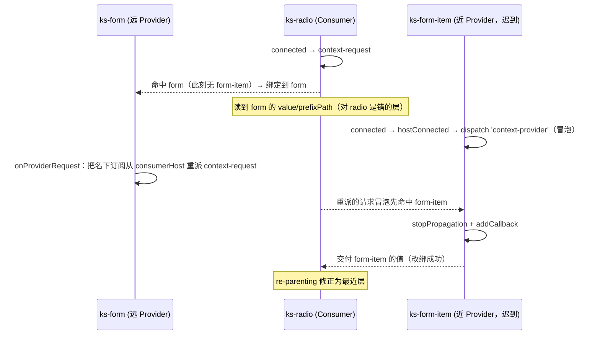

**边界风险（中）**：**没有 re-parenting，此场景静默绑错层** —— radio 一直读外层 form 的 `_prefixPath`/`disabled`/`value` 切片，而非它真正所属的 form-item。无报错。
**触发条件**：中间 provider 的 `define`/upgrade 晚于其子 consumer（代码分割、懒注册），或运行时把已有节点重新 parent 进新的中间 provider，或 **SSR hydration 逆序**。
**排查项**：库是否有懒注册 form-item/form-list、动态包裹已有字段的路径？keystone 的 React-only SSR 水合顺序是否可能逆序？

---

## 场景 E：框架 wrapper 在挂载前设置 provider 属性（pending 值）⚠️ 保真修复点

React/Vue wrapper 常在元素连接前 `el.prop = x`。

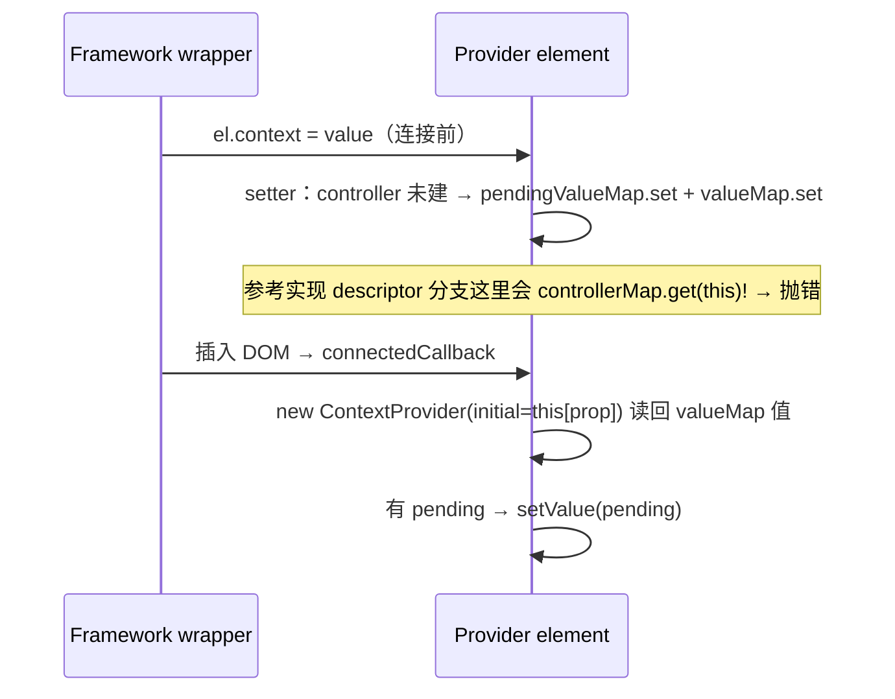

**边界风险**：参考实现的 **descriptor-exists 分支**里 setter 直接 `controllerMap.get(this)!.setValue(...)`，
连接前设值会 `undefined!.setValue` **抛错**。已确认**没有任何 @Provide 属性带 co-decorator**，该分支实际走不到 —— 端口**删除该分支**，只留 pending 路径，从根上消除这个坑。
**结论**：端口下正常（且更健壮）。

---

## 场景 F：same element 既 provide 又 consume 同一 context 🔁 自排除

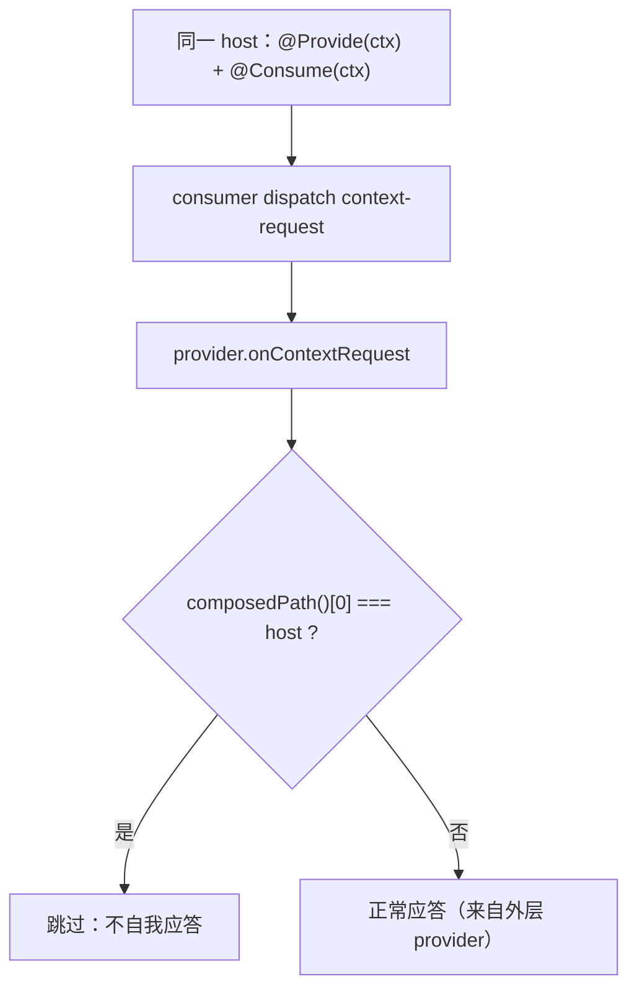

**结论**：`onContextRequest` 用 `composedPath()[0] === this.host` 排除自身（`ev.target` 因 retarget 不可靠，故用 composedPath）。
consumer 会向**外层**同 context provider 求值，不会绑到自己。正常。**排查项**：确认库里是否真有 self provide+consume（若无，此复杂度是预防性的）。

---

## 场景 G：`subscribe:false` 一次性 vs `subscribe:true` 订阅 ⚠️ 时序

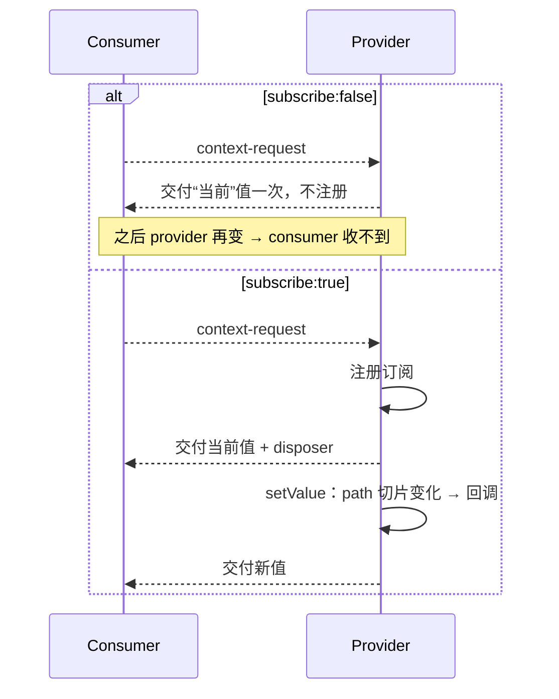

**边界风险（低-中）**：`subscribe:false` 拿到的是**连接那一刻**的值。若 provider 的真实值在 consumer 连接**之后**才 set（如 provider 的 `componentWillLoad` 里才组装 context），one-shot consumer 会拿到**过时/初始**值且不再更新。
**排查项**：库里 `subscribe:false` 的 `@Consume`（如 `ks-form-item` 的 `path:['callbacks']`）依赖的那部分，是否保证在 consumer 连接前已定稿？

---

## 场景 H：provider 就地 mutate 而非换引用 ❌ 潜在漏更新

`setValue` 只由 **setter** 触发；`Object.is` 用整值/切片比较。

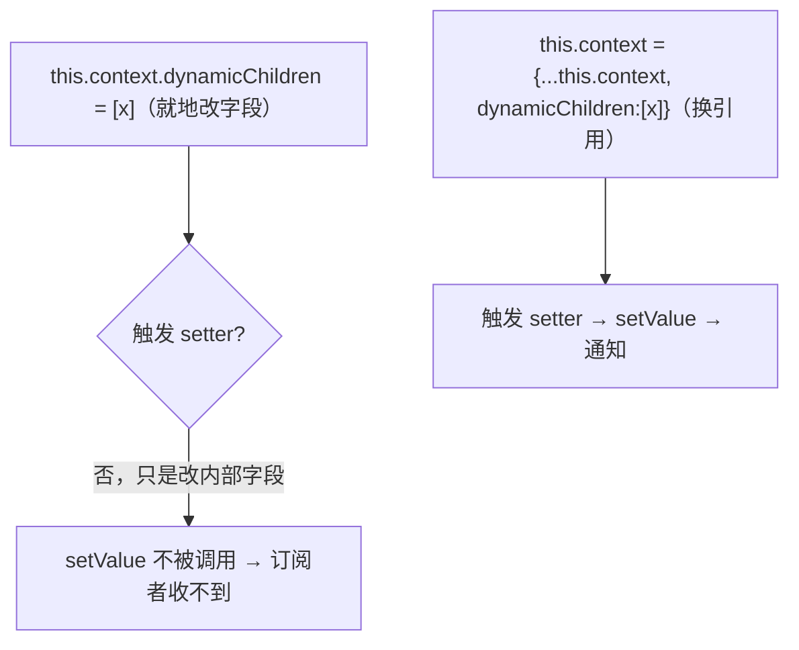

**边界风险（中）**：`ks-cascader` 里有 `this.context.dynamicChildren = [children]` 这类**就地 mutate**（见 index.tsx:585）。
若依赖它通知 consumer 会**漏更新**。这是**组件侧**约定问题（应换引用），不是端口能修的 —— 但要在文档里点名，避免误判为端口 bug。
另注：即便换引用，`ValueNotifier` 对**顶层**引用做 `Object.is`；带 `path` 的订阅是对**切片**做 `Object.is`，`{...spread}` 会让未变的切片仍是同引用 → 正确地**不**误触发。

---

## 场景 I：consumer disconnect / reconnect（React 列表重排、移动节点）✅ 但需验证

`@Consume` patch 的是 `connectedCallback`，**每次连接都 new 一个 ContextConsumer**。

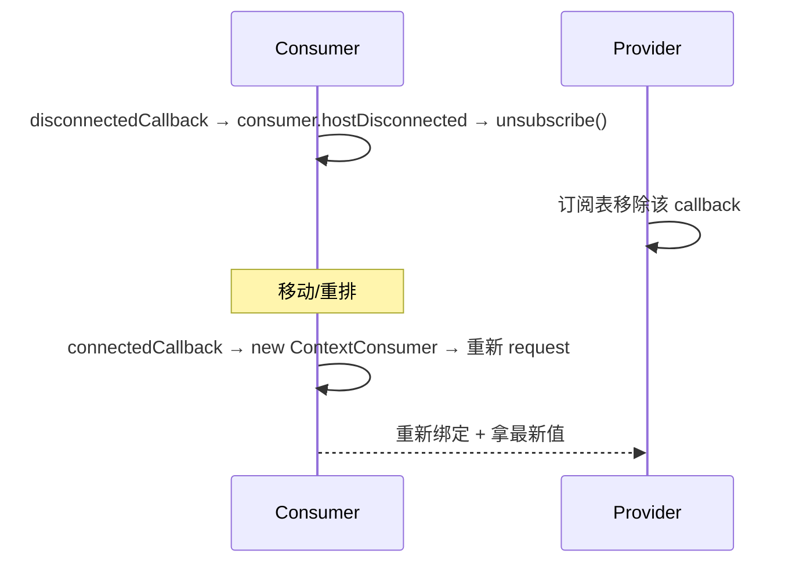

**边界风险（低）**：每次 reconnect 建**新** consumer 是否泄漏旧订阅？—— disconnect 已 `unsubscribe`，且 provider 侧 `subscriptions` 以 callback 为 key；新 consumer 的 `_callback` 是新函数实例，不会与旧的碰撞。看起来干净。
**排查项**：keystone 里元素被移动时 `disconnectedCallback`→`connectedCallback` 是否成对触发（浏览器保证成对；但要确认 keystone 没有额外吞掉）。

---

## 场景 J：provider disconnect，consumer 仍存活 ⚠️ 悬挂 consumer

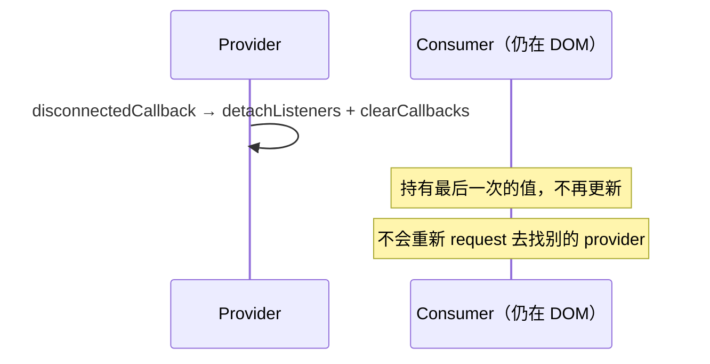

**边界风险（中）**：provider 先于 consumer 卸载（如只移除中间 provider 层，保留子树），consumer 变“悬挂”——保留旧值、静默不更新、也不回退到外层 provider。
Lit 同样有此限制（靠 `ContextRoot` 缓解重连）。
**排查项**：库是否有“只卸载中间 provider、保留子 consumer”的场景？表单里通常整块增删，风险较低。

---

## 场景 K：consumer 在首次渲染前收到值 ✅ keystone 时序

keystone `forceUpdate` 要求 `HOST_FLAGS.hasRendered` 才排渲染。consumer 的 `connectedCallback` wrapper（最外层）**先于** proxy 的 `connectedCallback` 执行。

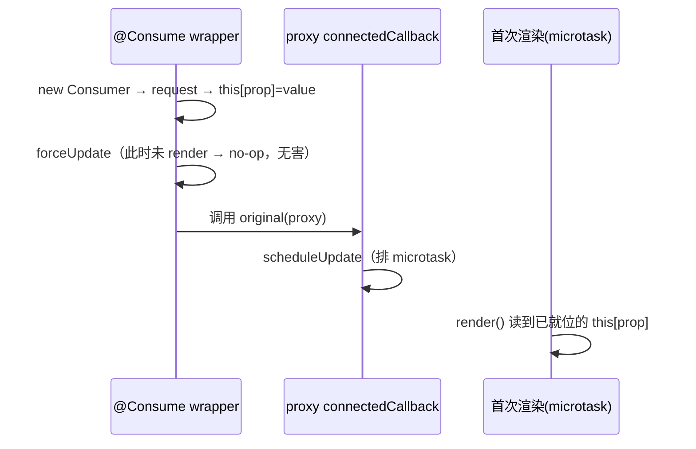

**结论**：正常。value 在首帧前已落到实例字段；`forceUpdate` 的 pre-render no-op 不影响，首帧会自然读到。**这是必须有测试钉死的时序。**

---

## 场景 L：同一 host 上多个同 context provider 🔁 无限循环防护

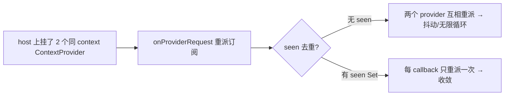

**边界风险（低，预防性）**：`onProviderRequest` 的 `seen: Set` 是防同 host 多 provider 的循环。
**排查项**：库里应无“同一元素多次 provide 同 context”，此防护是继承自 Lit 的保险。若确认用不到，可评估随 re-parenting 一起去留。

---

## 汇总：边界风险清单

| 场景 | 风险 | 端口现状 | 需要排查/决策 |
| --- | --- | --- | --- |
| B 顶层 provider 迟到 | **高**（静默拿不到值） | 无 `ContextRoot` | 库是否有 consumer 先于顶层 provider 连接？ |
| D 更近 provider 迟到 | 中（静默绑错层） | 靠 re-parenting | 懒注册/动态中间 provider/SSR 逆序是否存在？→ 决定 re-parenting 去留 |
| E 连接前设 provider 属性 | 低 | 端口删 descriptor 分支后**已消除** | 无 |
| G subscribe:false 时序 | 低-中 | 按协议 | one-shot 依赖项是否连接前定稿？ |
| H provider 就地 mutate | 中 | 组件约定问题 | `ks-cascader` 等就地 mutate 是否依赖通知？ |
| I consumer 重连 | 低 | 看似干净 | 确认 disconnect/connect 成对 |
| J provider 先卸载 | 中 | 同 Lit 限制 | 是否有只卸中间 provider 的场景？ |
| K 首帧前收值 | — | 正常 | 用测试钉死时序 |
| L 同 host 多 provider | 低 | seen 防护 | 是否真会发生？ |

## 待你定的两个核心问题

1. **re-parenting（场景 D、L 相关）保留还是删**：取决于库是否有异步/逆序中间 provider，以及 SSR 水合顺序。
2. **要不要补 `ContextRoot`（场景 B）**：取决于是否存在 consumer 先于顶层 provider 的路径。参考实现没补，可能是因为业务上 provider 总是静态先行。

下一步建议：对 D/B/H 三个高中风险场景，去库里 grep 实际触发路径（懒注册、动态 parent、就地 mutate、条件渲染 provider），用证据把上面两个决策定死。
